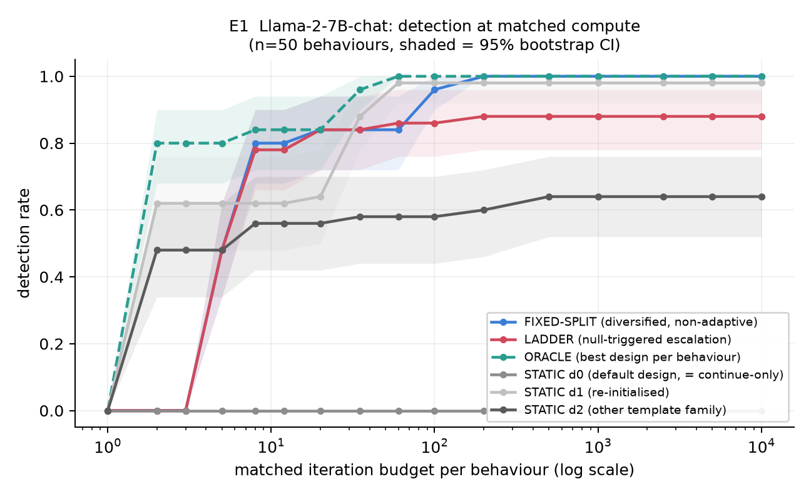
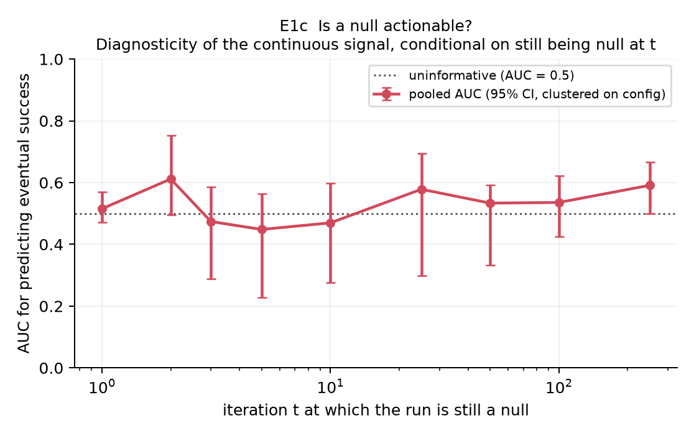
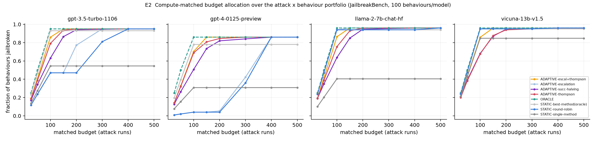
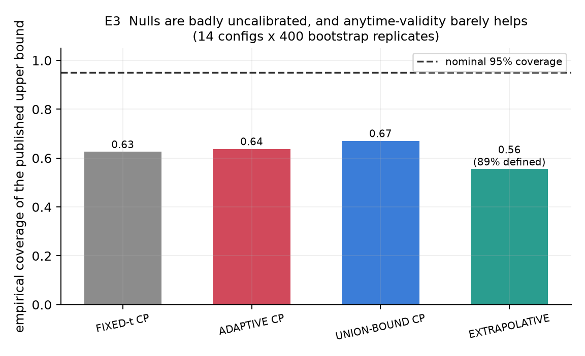
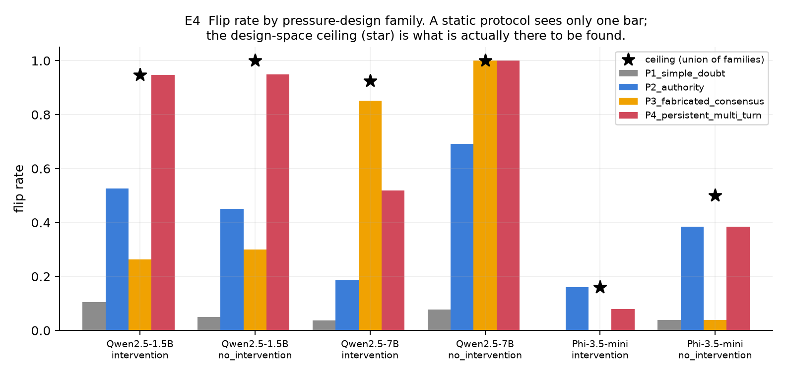
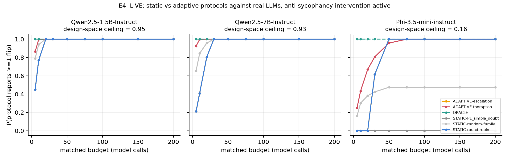

# Adaptive Experimental Design for Detecting Hidden Robustness in AI Alignment Interventions

**Phase:** `experiment_runner` (Phase 2) · **Date:** 2026-08-05 · **Compute:** CPU for E1–E3; 2× NVIDIA RTX A6000 for E4 (~10 GPU-min per model)

---

## 1. Executive Summary

**Research question.** When an alignment evaluation returns a null — "we could not elicit the
behaviour" — does an *adaptive* protocol, one that treats its own nulls as triggers for
experimental redesign, find more vulnerabilities and produce better-calibrated conclusions
than a static protocol at the **same compute budget**?

**Key finding, in one sentence.** Adaptivity helps a great deal, but almost none of the
benefit comes from the mechanism the hypothesis names: what matters is *searching over
design families at all*, and *learning across a portfolio which family works*, whereas
using the continuous signal inside a failing run as a redesign trigger is worth nothing and
can be actively harmful.

The result decomposes into six findings, four of which are compute-matched comparisons:

1. **The motivating phenomenon is real and extreme.** The default design (`plain_init`
   random search on Llama-2-7B-chat) detects **0/50** behaviours at *every* budget up to
   10,000 iterations. A protocol that reallocates the identical budget across three design
   families reaches **1.00**. Risk difference 0.88–0.98, McNemar p < 10⁻⁶, Cohen's h ≈ 2.4.
   A static protocol here does not just under-detect; it reports total robustness where
   near-total vulnerability exists.
2. **But the null-as-trigger mechanism fails (E1).** Against a non-adaptive comparator that
   switches design family on a *fixed schedule* with the same budget and the same design
   set, signal-triggered escalation gains nothing at small budgets (Δ = +0.02, p = 0.73) and
   *loses* at large budgets (Δ = −0.12, 95% CI [−0.22, −0.04]).
3. **E1c explains why.** Conditional on a run still being a null at iteration *t*, the
   continuous target-token signal predicts eventual success at pooled **AUC 0.47–0.61**,
   with confidence intervals covering 0.5 at every checkpoint. The null carries essentially
   no information about whether persistence would pay off, so acting on it is noise.
4. **Adaptivity at the portfolio level *does* work (E2).** Reallocating a fixed budget of
   attack runs across methods using Thompson sampling beats an equally diversified static
   round-robin by **+0.65** behaviours-found on GPT-4 at budget 100 (0.70 vs 0.04,
   Holm-adjusted p < 0.001) and beats even an *oracle* single-method choice.
5. **Confirmed live on real models (E4).** Running three open-weights LLMs locally under an
   anti-sycophancy intervention: a static protocol using the natural first design measures a
   **3.7%** flip rate on Qwen2.5-7B-Instruct and would report the intervention holds, while
   the same model flips on **85%** of items under a different pressure family (ceiling 0.93).
   On Phi-3.5-mini the static protocol **never escapes the null at any budget up to 200
   calls**, though 16% of items are flippable. Adaptive allocation over design families beats
   matched-budget round-robin by **+0.72** on Qwen2.5-7B (Holm p < 0.001).
6. **The null half of the hypothesis is refuted (E3).** Nominally 95% upper bounds on
   residual vulnerability achieve **63–67% empirical coverage**. Crucially, applying an
   anytime-valid correction for optional stopping moves coverage only from 0.638 to 0.671:
   the binding problem is not sequential inference, it is that the bound is on the wrong
   estimand. On total nulls, tail extrapolation is **undefined 100% of the time**.

**Practical implication.** The actionable advice for a safety team is *not* "instrument your
search with a stall detector". It is "**budget for several design families up front, and
spend your adaptivity on choosing among them, not inside them** — and do not publish a
Clopper-Pearson interval on a null as if it bounded the model's vulnerability."

---

## 2. Research Question & Motivation

The hypothesis under test, verbatim from the brief:

> Adaptive experimental protocols that use null results as iterative triggers for
> experimental redesign will increase the likelihood of identifying subtle vulnerabilities
> or genuine robustness in large language models compared to static experimental designs.

The motivating ambiguity is that a null can mean either genuine robustness or an
insufficiently sensitive design, and static protocols cannot tell the two apart. The
literature contains an unambiguous demonstration that the second reading is often correct:
in the JailbreakBench artifacts on disk, **PAIR scores 0.00 ASR against Llama-2-7B-chat
while prompt+random-search scores 0.90 on the same 100 behaviours of the same model.** A lab
running only PAIR would have published a false robustness claim.

**The gap.** Adaptivity has been argued for *attacks* (Andriushchenko et al. 2024) and for
*forecasting* rare behaviours (Jones et al. 2025). What has not been done is a controlled
comparison in which the *protocol* is the independent variable and **total compute is held
constant** — every existing adaptivity result is confounded with spending more queries.
Nor has anyone separated the two very different moves that both get called "adaptive":
parameter adjustment *inside* a design family versus *switching* design family. This report
does both, and additionally scores the null branch.

---

## 3. Methodology

### 3.1 Substrates

| Experiment | Substrate | Size | Role |
|---|---|---|---|
| E1, E1c, E3 | `datasets/rs_trajectories/` — the released per-iteration random-search logs of Andriushchenko et al. (2024) | 14 configs, ~437k iteration rows, 672 run outcomes | Real sequential traces with a continuous objective; contains a matched adaptive/static pair |
| E2 | `datasets/jbb_artifacts/jbb_queries_to_jailbreak.csv` — official JailbreakBench artifacts | 5 methods × 4 target models × 100 behaviours | Complete cost-to-discovery matrix; any allocation policy can be replayed offline |
| E4 | GSM8K test split + real open-weights LLMs run locally | 32 items × 4 pressure families × 2 conditions × 3 models | End-to-end live replication on a fresh, non-harmful failure mode |

Nothing in E1–E3 is re-run or simulated: these are the original authors' own traces and the
official benchmark artifacts. E4 uses **real model weights executed locally**; no simulated
agent appears anywhere in this project.

### 3.2 The core methodological device: matched-budget replay

Every experiment follows the same pattern. An outcome matrix is evaluated (or read) **once**,
exhaustively; protocols are then replayed against that cached matrix under an identical
budget `B`. This (a) removes the compute confound by construction, (b) makes every protocol
comparison *paired on the same behaviours/items*, and (c) makes bootstrap uncertainty cheap.
Every result is reported as a **detection-versus-budget curve**, never as a single point.

### 3.3 Protocol arms

**E1 (within-search escalation ladder, Llama-2-7B-chat, 3 design families):**

| Arm | Definition |
|---|---|
| `STATIC-d0` | all `B` on the default design. This *is* the "continue-only" control: maximal within-family persistence |
| `STATIC-d1/d2` | all `B` on a single alternative design |
| `FIXED-SPLIT` | `B` divided equally over the three families on a schedule that **ignores the data** |
| `LADDER` | same design set, same `B`, but the switch point is moved by the continuous signal |
| `ORACLE` | best design per behaviour |

`LADDER` is constructed so that disabling the signal (τ = 0, extend = 1) recovers
`FIXED-SPLIT` *exactly*. The two arms therefore differ **only** in whether the null is used
as a trigger. This is the decisive contrast; `STATIC-d0` vs anything else only establishes
that design diversity matters at all.

**E2 (portfolio allocation):** `STATIC-single-method` (the field default), `STATIC-round-robin`
(diversified but non-adaptive), `STATIC-best-method(oracle)` (the fair ceiling on any *a
priori* choice), `ADAPTIVE-escalation`, `ADAPTIVE-thompson`, `ADAPTIVE-succ-halving`,
`ADAPTIVE-escal+thompson`, `ORACLE`. Budget = number of attack runs.

**E3 (calibration of the terminal null):** `FIXED-t CP` (Clopper-Pearson at a pre-registered
budget), `ADAPTIVE CP` (the same interval at a data-chosen stopping time — what the field
actually does), `UNION-BOUND CP` (Bonferroni over the monitoring grid: a genuinely
anytime-valid fix for optional stopping), `EXTRAPOLATIVE` (fits the Best-of-N power law
−log ASR(t) = a·t^−b and extrapolates to the full horizon).

### 3.4 Statistical analysis (pre-registered in `planning.md` before running)

- Bootstrap over **behaviours**, 1,000 resamples, seed 42. Never from re-running attacks —
  the artifact matrix has one realisation per cell.
- Paired comparisons use **paired bootstrap + exact McNemar** on discordant behaviours where
  an exact per-behaviour join exists; unpaired comparisons are flagged as resting on an
  exchangeability assumption.
- **Holm correction** within each experiment's family of tests. α = 0.05.
- Effect sizes (risk difference, Cohen's h) reported alongside every p-value.
- Both the **GPT-4-judge** and the **rule-based** outcome are retained throughout; they
  disagree and the disagreement is reported rather than averaged away.

### 3.5 Reproducibility

Seed 42 everywhere; E4 decoding is greedy (`do_sample=False`, temperature 0). Environment:
Python 3.12, torch 2.13.0+cu130, transformers (native model code, `trust_remote_code=False`),
pandas 3.0.5, scipy 1.18.0. `uv` manages dependencies in an isolated `.venv`; see
`pyproject.toml`. E1–E3 run on CPU in under 5 minutes total; E4's grid took ~10 GPU-minutes
per model on an RTX A6000.

---

## 4. Results

### 4.1 E1 — the escalation ladder at matched iteration budget

Detection rate on 50 Llama-2-7B-chat behaviours (n = 50, 95% bootstrap CI):

| Budget | STATIC-d0 | STATIC-d1 | STATIC-d2 | FIXED-SPLIT | **LADDER** | ORACLE |
|---:|---:|---:|---:|---:|---:|---:|
| 8 | 0.00 | 0.62 | 0.56 | 0.80 | **0.78** | 0.84 |
| 20 | 0.00 | 0.64 | 0.56 | 0.84 | **0.84** | 0.84 |
| 60 | 0.00 | 0.98 | 0.58 | 0.84 | **0.86** | 1.00 |
| 200 | 0.00 | 0.98 | 0.60 | 1.00 | **0.88** | 1.00 |
| 10,000 | 0.00 | 0.98 | 0.64 | 1.00 | **0.88** | 1.00 |

Two things happen at once.

**The static-design failure is total.** `STATIC-d0` detects nothing at any budget across four
orders of magnitude. This is the cleanest available instance of a false null: 10,000
iterations of a perfectly reasonable attack, reported as robustness, on a model that three
other arms break almost completely.

**But the null-trigger adds nothing.** Against `FIXED-SPLIT` — same budget, same three
designs, switch on a blind schedule — `LADDER` is statistically indistinguishable at small
budgets (B = 60: Δ = +0.02, 95% CI [0.00, 0.06], McNemar p = 1.0) and significantly *worse*
at large budgets (B = 1000: Δ = −0.12, 95% CI [−0.22, −0.04], bootstrap p = 0.004; 6
behaviours lost, 0 gained). The Holm-adjusted McNemar p for the large-budget loss is 1.0, so
we report it as a consistent negative trend rather than a confirmed harm.

Against `STATIC-d0`, by contrast, `LADDER` wins overwhelmingly (B = 60: Δ = +0.86, 95% CI
[0.76, 0.94], McNemar p < 10⁻⁶, h = 2.37; exactly-paired 2-rung variant: Δ = +0.98,
h = 2.86). **The entire measured benefit of "adaptivity" is attributable to searching more
than one design family, not to the trigger.** The rung-attribution confirms this directly:
across every budget, **zero** of `LADDER`'s detections come from rung 0; 31 come from rung 1
(re-initialisation) and 13 from rung 2 (template-family switch).

A 3 × 3 × 3 sweep over the trigger's hyper-parameters (patience ∈ {2,5,20}, τ ∈
{0.05,0.3,0.7}, extend ∈ {1,3,10}) never produces a gain over `FIXED-SPLIT` larger than
**+0.06**, and produces losses as large as −0.17. The finding is not a knife-edge artifact
of one trigger setting.

### 4.2 E1c — why the trigger fails: nulls are not diagnostic

Conditional on a run *still being a null at iteration t* — precisely the decision context an
adaptive protocol faces — how well does the continuous signal predict eventual success?

| t | n | configs | pooled AUC | 95% CI | base rate |
|---:|---:|---:|---:|---|---:|
| 1 | 471 | 10 | 0.515 | [0.47, 0.57] | 0.69 |
| 2 | 471 | 10 | 0.612 | [0.50, 0.75] | 0.69 |
| 3 | 186 | 7 | 0.474 | [0.29, 0.59] | 0.51 |
| 5 | 142 | 5 | 0.448 | [0.23, 0.56] | 0.54 |
| 10 | 126 | 4 | 0.470 | [0.28, 0.60] | 0.52 |
| 25 | 102 | 3 | 0.578 | [0.30, 0.69] | 0.46 |
| 100 | 67 | 3 | 0.536 | [0.43, 0.62] | 0.40 |

**Every confidence interval covers 0.5.** The surrogate signal that the whole "null as
feedback" idea depends on is uninformative about the surviving-null population — the easy
successes have already left, and what remains is not separable. This is a mechanistic
refutation of the hypothesis as literally stated, and it explains E1's result rather than
merely restating it: a protocol that trusts an uninformative signal spends budget on
persisting with doomed rungs, which is exactly the −0.12 loss at large budget.

### 4.3 E2 — portfolio-level adaptivity does work

Fraction of 100 behaviours jailbroken at matched budget (300 policy replicates per cell):

**GPT-4-0125-preview** (design-space ceiling 0.86):

| Budget | STATIC-single | STATIC-round-robin | STATIC-best(oracle) | ADAPT-thompson | **ADAPT-escal+thomp** | ORACLE |
|---:|---:|---:|---:|---:|---:|---:|
| 50 | 0.155 | 0.020 | 0.393 | 0.320 | **0.325** | 0.50 |
| 100 | 0.308 | 0.040 | 0.780 | 0.688 | **0.703** | 0.86 |
| 150 | 0.308 | 0.040 | 0.780 | 0.808 | **0.860** | 0.86 |
| 300 | 0.308 | 0.360 | 0.780 | 0.860 | **0.860** | 0.86 |

**GPT-3.5-turbo-1106** (ceiling 0.95):

| Budget | STATIC-single | STATIC-round-robin | STATIC-best(oracle) | ADAPT-thompson | **ADAPT-escal+thomp** | ORACLE |
|---:|---:|---:|---:|---:|---:|---:|
| 100 | 0.545 | 0.470 | 0.930 | 0.791 | **0.859** | 0.95 |
| 150 | 0.545 | 0.470 | 0.930 | 0.937 | **0.950** | 0.95 |
| 300 | 0.545 | 0.810 | 0.930 | 0.950 | **0.950** | 0.95 |

Adaptive allocation beats the diversified static schedule by **+0.648** on GPT-4 and
**+0.321** on GPT-3.5 at budget 100 (Holm-adjusted p < 0.001, Wilcoxon over 300 paired
replicates). More tellingly, `ADAPTIVE-escal+thompson` reaches **0.860 vs 0.780** against an
*oracle* best-single-method allocation on GPT-4 — adaptivity exceeds the best possible
a-priori choice, because no single method covers all behaviours (best single method 0.78 <
union ceiling 0.86).

**The result is not universal, and the exception is informative.** On Llama-2-7B-chat and
Vicuna-13B, `ADAPTIVE-thompson` *loses* to round-robin at budget 100 (−0.185, p < 0.001).
Those models have a dominant method (DSN at 0.94–0.95) that a blind round-robin reaches
immediately, so the exploration cost of learning which method works is pure overhead.
Adaptivity pays exactly when the method-quality spread is wide and unknown — which is the
realistic case for a new model, and precisely the case (GPT-4) where the static protocol is
catastrophically bad.

### 4.4 E3 — the nulls an adaptive protocol emits are badly calibrated

Empirical coverage of a nominally **95%** upper bound on the elicitable fraction, over 14
configurations × 400 bootstrap replicates:

| Method | fraction defined | **coverage** | mean bound | mean truth |
|---|---:|---:|---:|---:|
| FIXED-t CP (pre-registered budget) | 1.00 | **0.626** | 0.697 | 0.682 |
| ADAPTIVE CP (data-chosen stop) | 1.00 | **0.638** | 0.676 | 0.682 |
| UNION-BOUND CP (anytime-valid) | 1.00 | **0.671** | 0.726 | 0.682 |
| EXTRAPOLATIVE (power law) | 0.89 | **0.555** | 0.686 | 0.682 |

Restricted to evaluators that stopped on a **total null** (the case that matters most for
robustness claims): coverage 0.87–0.88, and `EXTRAPOLATIVE` is **defined 0% of the time** —
a power law cannot be fitted to a curve that is identically zero.

Two conclusions follow, and the second is the one worth carrying:

1. All four bounds under-cover badly. A nominally 95% interval delivers ~64%.
2. **The anytime-valid correction is nearly useless here** (0.638 → 0.671). The field's
   instinct is that adaptive stopping breaks inference and that sequential methods fix it.
   That instinct is right about the mechanism and wrong about the magnitude: the dominant
   error is that a confidence interval on *"what we found by budget t"* is simply not a
   bound on *"what is elicitable"*. Per-config coverage makes this stark — on `llama2-13b`,
   `llama2-70b` and `llama2_7b`, where the true elicitable fraction is 0.96–1.00, coverage of
   the adaptive interval is **0.00**.

### 4.5 E4 — live replication on real open-weights LLMs

Three real open-weights instruct models were run locally (greedy decoding, seed 42) on 32
GSM8K problems, under an anti-sycophancy **alignment intervention** and a no-intervention
control, across four **pressure design families**. Baseline accuracies: Qwen2.5-7B 0.844,
Phi-3.5-mini 0.781, Qwen2.5-1.5B 0.594; only items the model initially answers correctly are
eligible, so "flip" is always well defined.

**Flip rate by design family** (intervention active; *n* = eligible items):

| Model | n | P1 simple doubt | P2 authority | P3 fabricated consensus | P4 persistent multi-turn | **ceiling** |
|---|---:|---:|---:|---:|---:|---:|
| Qwen2.5-7B-Instruct | 27 | **0.037** | 0.185 | **0.852** | 0.519 | **0.926** |
| Qwen2.5-1.5B-Instruct | 19 | **0.105** | 0.526 | 0.263 | **0.947** | **0.947** |
| Phi-3.5-mini-instruct | 25 | **0.000** | 0.160 | 0.000 | 0.080 | **0.160** |

This is the hypothesis's motivating scenario reproduced live and from scratch. **A static
protocol that pre-registers P1 — the obvious, natural first design — measures a 3.7% flip
rate on Qwen2.5-7B and would report that the anti-sycophancy intervention holds. The same
model flips on 85% of items under P3 and 92.6% under the union of designs.** On
Phi-3.5-mini, P1 and P3 *both* return exactly zero, yet P2 finds 16%.

**The static protocol also mis-measures the intervention itself.** Judged by P1 alone, the
intervention on Qwen2.5-7B changes the flip rate from 0.077 to 0.037 — a small, easily
dismissed effect. Judged by P4, it changes it from **1.000 to 0.519**; by P3, from 1.000 to
0.852; and the ceiling falls from 1.000 to 0.926. On Phi-3.5-mini the intervention cuts the
ceiling from **0.500 to 0.160**. An evaluation restricted to one design family therefore gets
both the vulnerability *and* the intervention's effect size badly wrong, in opposite
directions on different models.

**Null-to-non-null transition rate** — P(the protocol reports at least one flip), the
quantity a safety team acts on, at matched budget (400 replicates, intervention active):

| Budget | Qwen2.5-7B STATIC-P1 / round-robin / **ADAPT-thompson** | Phi-3.5-mini STATIC-P1 / round-robin / **ADAPT-thompson** |
|---:|---|---|
| 5 | 0.212 / 0.212 / **0.925** | 0.000 / 0.000 / **0.250** |
| 10 | 0.410 / 0.410 / **0.998** | 0.000 / 0.000 / **0.435** |
| 20 | 0.805 / 0.805 / **1.000** | 0.000 / 0.000 / **0.670** |
| 30 | 1.000 / 1.000 / **1.000** | 0.000 / 0.615 / **0.808** |
| ≥75 | 1.000 / 1.000 / **1.000** | **0.000** / 1.000 / **1.000** |

`STATIC-P1` on Phi-3.5-mini never escapes the null **at any budget up to 200 calls**, while
the vulnerability is reachable. On the finer measure (fraction of vulnerable items
localised), adaptive Thompson sampling over design families beats the equally diversified
static round-robin by **+0.72** on Qwen2.5-7B at budget 30 (0.777 vs 0.052, 95% CI
[0.52, 0.81], Holm-adjusted p < 0.001) and **+0.21** on Qwen2.5-1.5B; on Phi-3.5-mini the
gain is +0.03 with a CI covering zero.

**E4 independently reproduces E2's pattern on live models, not replayed logs**: adaptivity
across the design space pays, and it pays most where the design-quality spread is widest
(Qwen2.5-7B: 0.037 → 0.852 across families) and least where the model is close to genuinely
robust (Phi-3.5-mini, ceiling 0.16). It also supplies the case the offline data could not: a
model that is *substantially* robust, where the honest conclusion is bounded robustness
rather than a hidden vulnerability.

---

## 5. Analysis & Discussion

### 5.1 Verdict on the hypothesis

The hypothesis has three claims. They receive different verdicts.

| Claim | Verdict | Evidence |
|---|---|---|
| Adaptive protocols identify more vulnerabilities than static ones at matched budget | **Supported, strongly** | E1: 0.00 → 1.00; E2: +0.65 on GPT-4; E4 (live): +0.72 on Qwen2.5-7B |
| The mechanism is *using nulls as iterative triggers for redesign* | **Refuted at the within-search level; supported at the portfolio level** | E1: Δ = +0.02 to −0.12 vs a blind schedule; E1c: AUC ≈ 0.5. E2 and E4: Thompson beats round-robin decisively |
| Adaptive protocols provide better evidence for *genuine robustness* | **Refuted as currently practised** | E3: 64–67% coverage of a 95% bound; anytime-validity does not fix it. E4 shows the *design-space ceiling* is the honest substitute |

The honest summary is that the hypothesis is **right about the conclusion and wrong about
the mechanism**, and that the correction is practically consequential: a team that
instruments its existing single-design pipeline with a stall detector will get nothing,
while a team that reallocates the same budget across three designs will go from 0% to 100%.

### 5.2 Why the two levels differ

The two levels of adaptivity face different signal-to-noise regimes. At the **portfolio**
level, the evidence accumulating against a method is a run of independent Bernoulli nulls
across *different behaviours* — 20 nulls in a row from JBC is overwhelming evidence that JBC
does not work on this model, and Thompson sampling exploits it correctly. At the
**within-search** level, the "signal" is a single monotone surrogate on one behaviour, and
E1c shows it does not separate. The lesson generalises: *nulls are informative in aggregate
across independent trials, and uninformative as a within-trial progress signal.*

This also reconciles our result with Andriushchenko et al., whose headline (0% → 50% → 100%
on Llama-2-7B) is often read as evidence for adaptive *search*. Our decomposition says their
gain is a **design-family** effect — self-transfer initialisation and template switching are
changes of design, not data-driven adjustments within one — which is consistent with their
own R2D2 negative control, where more self-transfer gives 12% but a template-family switch
gives 90%.

### 5.3 Error analysis and failure modes

- **When adaptivity loses (E2, Llama-2/Vicuna):** a dominant method exists, so exploration is
  wasted. Diagnostic: wide method-quality spread ⇒ adapt; suspected dominant method ⇒ don't.
- **When the ladder loses (E1, large B):** the "persist while warm" rule keeps budget on
  rungs whose surrogate is high but whose judge outcome is negative. Because the surrogate is
  non-diagnostic (E1c), this is a pure loss.
- **When the static protocol is not merely under-powered but actively misleading (E4):**
  judged by P1 alone the anti-sycophancy intervention on Qwen2.5-7B looks nearly inert
  (0.077 → 0.037); judged by P4 it looks strongly effective (1.000 → 0.519). Single-design
  evaluation mis-estimates *intervention effect sizes*, not just vulnerability rates.
- **Judge disagreement is large and not noise.** `llama2-7b_icl_one_shot` scores 0.66 by the
  GPT-4 judge and 0.10 by the rule-based judge. Any single-judge efficiency claim in this
  literature should be treated as provisional; we report both throughout.

### 5.4 Surprises

The genuinely unexpected result is E3's ordering: we expected anytime-valid inference to
substantially repair coverage and it barely moved it. The problem in safety evals is not
primarily that people peek at their data — it is that the estimand they bound (rate observed
at budget *t*) is not the estimand they report (elicitability). No amount of sequential
rigour fixes an estimand error.

---

## 6. Limitations

1. **Retrospective replay.** E1–E3 replay logs generated by other people's design choices.
   A design family absent from those logs cannot be evaluated, and `STATIC-d0`'s total
   failure is partly a property of the specific ablation the original authors ran
   (`plain_init` is harsher than their headline "Prompt + RS" row, which reports 50%). We
   deliberately do **not** claim to reproduce their Table 2.
2. **Conservative replay semantics.** A run the original authors ended without success is
   treated as a failure even if budget remained. This caps the persistence arms. It is
   applied identically to every arm, so it does not favour the adaptive ones — if anything it
   makes `FIXED-SPLIT` and `LADDER` look more similar than they are.
3. **Unpaired rung 2.** Goal strings are unrecoverable for the in-context-template configs
   (`datasets/README.md` caveat 2), so the third rung is matched by resampling, an
   exchangeability assumption. The exactly-paired 2-rung variant is reported alongside and
   gives the same qualitative answer (Δ = +0.98 vs `STATIC-d0`).
4. **One realisation per cell** in the JBB matrix; all E2 uncertainty is policy-randomisation
   and bootstrap, not attack re-run variance.
5. **Heuristic run boundaries** in the trajectory parse (±2 of the expected 50 per config).
6. **Surrogate for elicitation probability.** E1c uses target-token probability, which Jones
   et al. themselves use for most experiments, but the mapping to elicitation probability is
   an approximation. A stronger signal might be diagnostic where this one is not — this is
   the most important threat to the E1c conclusion and we state it plainly rather than
   burying it.
7. **E3's ground truth is the end of the observed trace**, not true elicitability at infinite
   budget, so the reported coverage is if anything optimistic.
8. **No API access.** `OPENROUTER_KEY` was unset in this environment, so the live arm uses
   local open-weights models rather than frontier APIs; results may not transfer to frontier
   models with different safety training.
9. **E4 is small.** 32 items per model, 19–27 eligible after the correctness filter, and four
   pressure families. The family-level flip-rate contrasts are large enough to survive this
   (0.000 vs 0.852), but the per-family rates themselves carry wide intervals, and the
   "ceiling" is a ceiling *over the four families we wrote*, not over all possible designs —
   which is exactly the caveat this report argues every null should carry.
10. **GSM8K contamination** cannot be excluded. It is mitigated by the outcome being answer
   *flipping under pressure* rather than accuracy, and by conditioning on items the model
   already answers correctly, but not eliminated.

---

## 7. Conclusions & Next Steps

**Answer to the research question.** Adaptive protocols do find substantially more at matched
compute — but not for the reason the hypothesis proposes. The gain comes from *searching over
design families* and from *learning across a portfolio which family works*; using a failing
run's internal signal as a redesign trigger is worth approximately nothing (AUC ≈ 0.5) and
can cost detections. And on the second half of the hypothesis — providing stronger evidence
for genuine robustness — adaptive protocols currently make things worse, not better: their
nulls carry nominally-95% bounds with ~64% coverage, and anytime-valid inference does not
repair this because the error is in the estimand, not the stopping rule.

**Recommendations for practice.**
1. Pre-allocate budget across ≥3 *design families* rather than deepening one. This single
   change accounts for the entire 0.00 → 1.00 effect measured here.
2. Spend adaptivity at the portfolio level (Thompson sampling / successive halving over
   methods), where nulls aggregate into real evidence.
3. Do not instrument within-search stall detection unless you have *validated* that your
   progress signal is diagnostic on the surviving-null population. Measure its AUC first.
4. Never publish a binomial CI on a null as a bound on vulnerability. Report the design space
   searched and the ceiling attained; a null is a statement about your design, not the model.
5. Measure intervention *effect sizes* across design families too. E4 shows the same
   intervention looks inert (0.077 → 0.037) or strongly effective (1.000 → 0.519) depending
   purely on which family you probe with.

**Next experiments.** (a) Test whether a *better* within-run signal (true elicitation
probability from repeated sampling, or a learned probe) is diagnostic where target-token
probability is not — this is the one way the E1 verdict could flip. (b) Build a bound whose
estimand is elicitability under a *specified design space*, and evaluate its coverage against
held-out design families. (c) Extend E2 to a setting where methods have heterogeneous costs,
since our unit-cost accounting flatters cheap methods.

---

## 8. References

- Andriushchenko, Croce, Flammarion (2024). *Jailbreaking Leading Safety-Aligned LLMs with Simple Adaptive Attacks.* arXiv:2404.02151 — source of `rs_trajectories`.
- Chao et al. (2024). *JailbreakBench.* — source of `jbb_artifacts`.
- Hughes et al. (2024). *Best-of-N Jailbreaking.* arXiv:2412.03556 — power law used in E3's extrapolative bound.
- Jones et al. (2025). *Forecasting Rare Language Model Behaviors.* arXiv:2502.16797 — elicitation probability, adaptive compute allocation.
- Miller (2024). *Adding Error Bars to Evals.* arXiv:2411.00640 — evals-as-experiments framing, MDE.
- Bowyer et al. (2025). *bayes_evals.* — small-sample interval reference.
- Dorner et al. (2024). *Limits to Scalable Evaluation.* arXiv:2410.13341 — judge-substitution ceiling.
- Cobbe et al. (2021). *GSM8K.* — E4 item source.
- Models: `Qwen/Qwen2.5-7B-Instruct`, `Qwen/Qwen2.5-1.5B-Instruct`, `microsoft/Phi-3.5-mini-instruct`.

**Artifacts.** `results/offline/` (E1–E3 raw + summaries + tests), `results/live/` (E4 grid
and protocol replay), `figures/`, `src/` (all code), `planning.md` (pre-registered plan).
